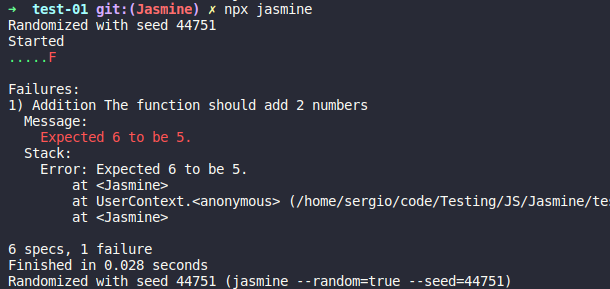

# Jasmine Testing

Jasmine is a behavior-driven development framework for testing JavaScript code. It does not depend on any other JavaScript frameworks. It does not require a DOM. And it has a clean, obvious syntax so that you can easily write tests.

### Integration 
- node
- ruby
- python
---
### Package Managers
- [npm](https://www.npmjs.com/package/ava)
- [yarn](https://yarnpkg.com/package/ava)

### Prerequisites
- node
- npm


---
Download from Nodejs site archived file...

```
sudo tar -C /usr/local --strip-components 1 -xzf node-v12.18.3-linux-x64.tar.xz
```
Check it is installed: 
```
node --version
npm --version
```
### Tests
 - Fail


 - Success
