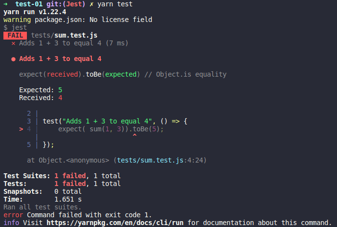
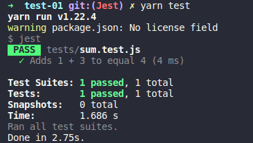

# Jest Testing

Jest is a delightful JavaScript Testing Framework with a focus on simplicity.

### Integration 
- Babel
- TypeScript
- Node
- React
- Angular
- Vue 
---

### Package Managers
- [npm](https://www.npmjs.com/package/ava)
- [yarn](https://yarnpkg.com/package/ava)

### Prerequisites
- node
- npm

### Install 
 - npm:  npm install --save-dev jest
 - yarn: yarn add --dev jest
---
Download from Nodejs site archived file...

```
sudo tar -C /usr/local --strip-components 1 -xzf node-v12.18.3-linux-x64.tar.xz
```
Check it is installed: 
```
node --version
npm --version
```

### Tests
 - Fail


 - Success
